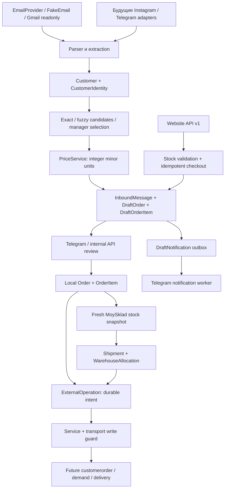

# Архитектура и рабочие flows

## Границы ответственности

Customer type не выводится жёстко из канала. Известный профиль имеет приоритет;
новые website/Instagram клиенты по существующей политике начинают как retail,
email/manual — unknown. Изменение типа существующего клиента требует manager
review. Неизвестный тип не получает цену и не может быть finalized.

МойСклад — источник товаров, цен, контрагентов и stock. «Цена продажи» — оптовая.
Retail mapping отсутствует; никакого fallback. Валюта контракта RUB, цены/итоги
BIGINT в копейках. Совпадающие retail/wholesale mappings блокируются. Product
matching выбирает автоматически только однозначные exact article/code/name;
fuzzy всегда возвращает кандидатов. Повторяющиеся ID удаляются перед matching.

Email сохраняется вместе с draft в одной транзакции; уникальный external ID
защищает повторную доставку. Channel adapters должны аутентифицировать источник,
используют namespace source/identity/external ID и общий `ingest_channel`.
Instagram и Telegram client transports пока не подключены.

Website checkout создаёт draft и idempotency response в одной транзакции.
PostgreSQL advisory lock сериализует одинаковые ключи. Несовпадающий payload
с прежним ключом даёт 409. Email, введённый анонимным посетителем, не является
логином или разрешением на оптовую цену. Новые контакты автоматически не
присоединяются к чужому существующему профилю.

## Конкурентность и внешние операции

Draft mutations и finalize используют row locks. Каждая бизнес-правка повышает
revision и инвалидирует готовый расчёт. Review сохраняется только для той же
revision. Telegram buttons содержат revision, а устаревшие/закрытые действия
отклоняются. Finalize повторно проверяет инварианты под блокировкой, атомарно
создаёт Order и ссылку draft → order. Никаких MoySklad writes при finalize.

Allocation — **план**, не резерв. `available=max(stock-reserve,0)` на каждом
активном складе; дробный остаток округляется вниз до целых продаваемых единиц.
Строки заказа суммируются перед распределением, shortage блокирует полный план.
По одному Shipment на Order/warehouse, повторное планирование возвращает тот же
план. Порядок — конфигурируемый список складов, иначе стабильная сортировка ID.
Окончательную бизнес-приоритетность складов необходимо подтвердить перед запуском.
Изменение stock между snapshot и будущим export возможно: необходима повторная
проверка и разрешённый резерв при activation. Локальные планы stock не уменьшают.

ExternalOperation фиксирует intent до HTTP. Успех replay-ится без второй записи.
Timeout, crash/inflight, неполный ответ или changed payload требуют ручной сверки;
автоматический повтор потенциально успешного POST запрещён. После успешного
external response и сбоя локального связывания повтор восстанавливает ссылку
из сохранённого результата. customerorder/demand получают стабильные syncId и
externalCode; эти поля помогают сверке, но не заменяют локальный журнал.

DeliveryService сохраняет provider-neutral DeliveryDraft и связывает его со
Shipment. СДЭК/Yandex/manual adapters выполняют только явный guarded submit.
Тариф, упаковка, pickup/address/coordinates требуют delivery quotation/config
после получения credentials; принятие Yandex claim автоматически не выполняется.

## Reliability и performance

Email cursor не продвигается при неуспешной обработке. Успешные письма при повторе
дедуплицируются. Постоянно некорректный sender требует операторского разбора;
cursor остаётся на прежнем месте, остальные сообщения batch продолжают обрабатываться.
Gmail 404 для удалённого сообщения пропускается; просроченный history cursor
перечитывает inbox согласно initial query. Attachment bodies игнорируются.

DraftNotification сохраняется атомарно с новой заявкой. Worker применяет lease,
SKIP LOCKED и bounded backoff. Доставка Telegram at-least-once: crash после отправки
может дать повторную карточку. Это не создаёт повторный заказ. Нужен один активный
Telegram poller на токен, отдельный notification worker; worker lease — 5 минут.

Менеджерская авторизация async, ACK до неё, sync HTTP вынесен в threads. Product
catalog имеет process-local TTL 60 секунд и single-flight. Stock не кэшируется.
Поиск и списки ограничены, relationships загружаются selectinload. Duration logs
содержат IDs, operation/outcome и длительности; query/URL/токены не логируются.
